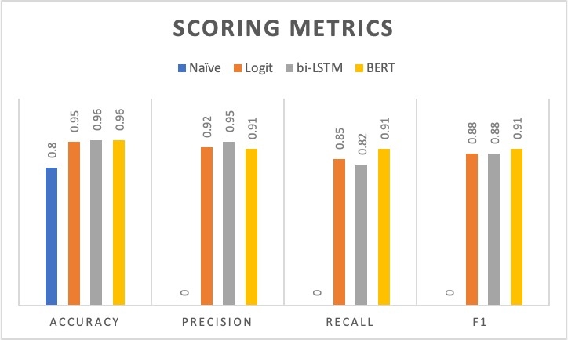

# Toxic-Comment-Classifiers

The increased use in social media has led to more human interactions, but at the cost of more toxic language. In this paper, we attempt to produce an automated classification system to flag toxic comments in social media using deep learning techniques. We broadly define toxic language as any comment that includes profanity, offensive language, or hate speech. We compared the performance of a Logistic Regression, a Bidirectional LSTM Neural Network, and a Bidirectional Encoder Representations from Transformers (BERT) model. The best model, in terms of F1 score and recall, is BERT, followed by the Bidirectional LSTM and the Logistic Regression. We observe high overfitting in the Bidirectional LSTM model, which we propose to improve by including more training data. Compared to other state-of-the-art classifiers, all our models are more robust in adversarial contexts, where users obfuscate toxic language. We propose more thorough preprocessing to recognize toxic text, such as using spell check.

See results of the models below.

# Data
Find a sample of the input data in sample_data/

# Analysis
Find the Data exploration, Logistic Regression, biLSTM and BERT classifications model notebooks in [src/models/]src/models/

## Presentation slides
https://docs.google.com/presentation/d/1WC6C03zoXjigjjxAV_hsDCdBcG27DAZtMcX1L058HDI/edit#slide=id.g12e6e4cab85_0_43

### Final Report
https://docs.google.com/document/d/19z9u4q6-XbwDPOQ4vcTaUrUd5gTJTdLtL9e8XKWA24I/edit

### Kaggle Dataset
https://www.kaggle.com/competitions/jigsaw-toxic-comment-classification-challenge/data

### Twitter Dataset
https://github.com/t-davidson/hate-speech-and-offensive-language/blob/master/data/labeled_data.csv
